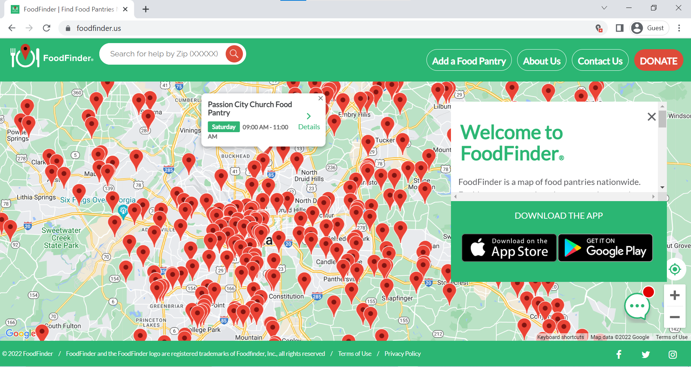
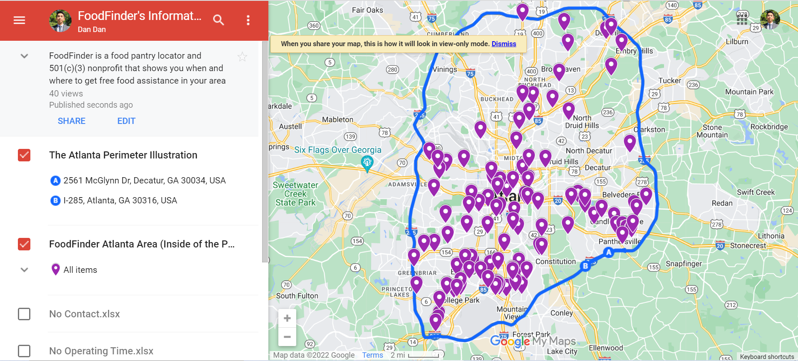
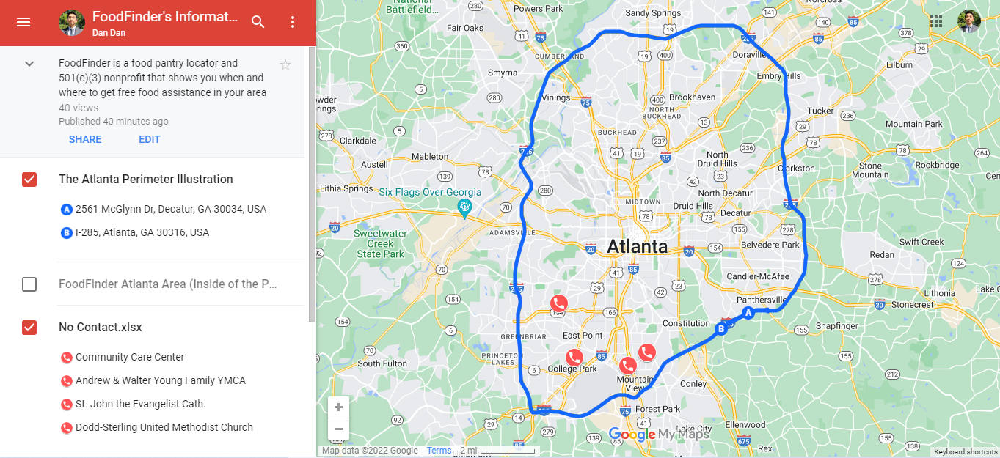
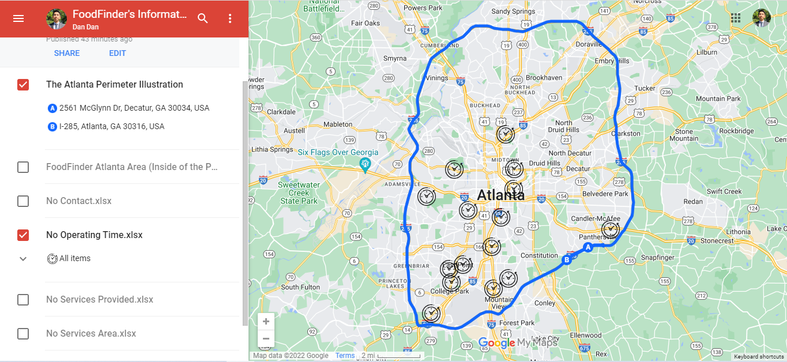
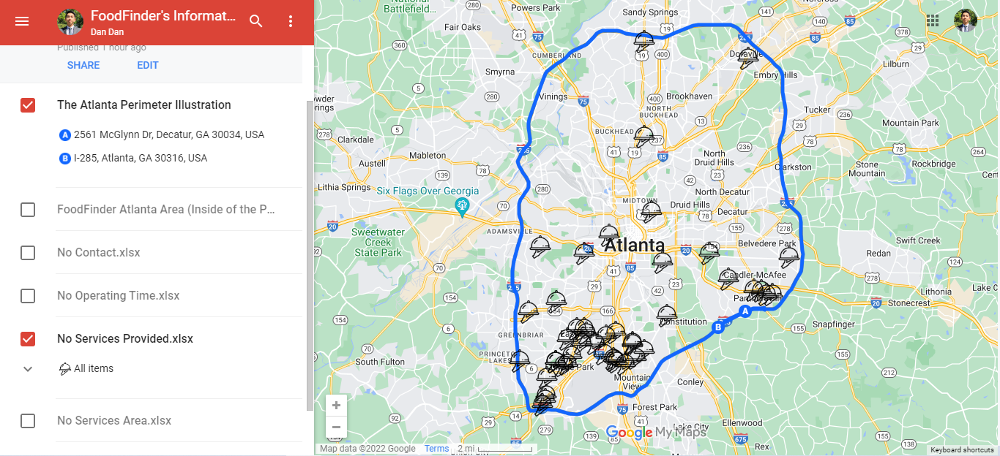
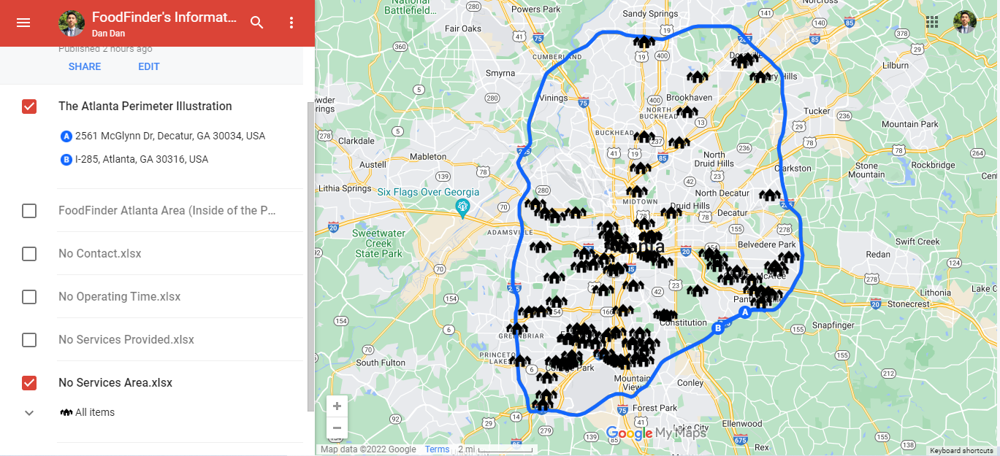
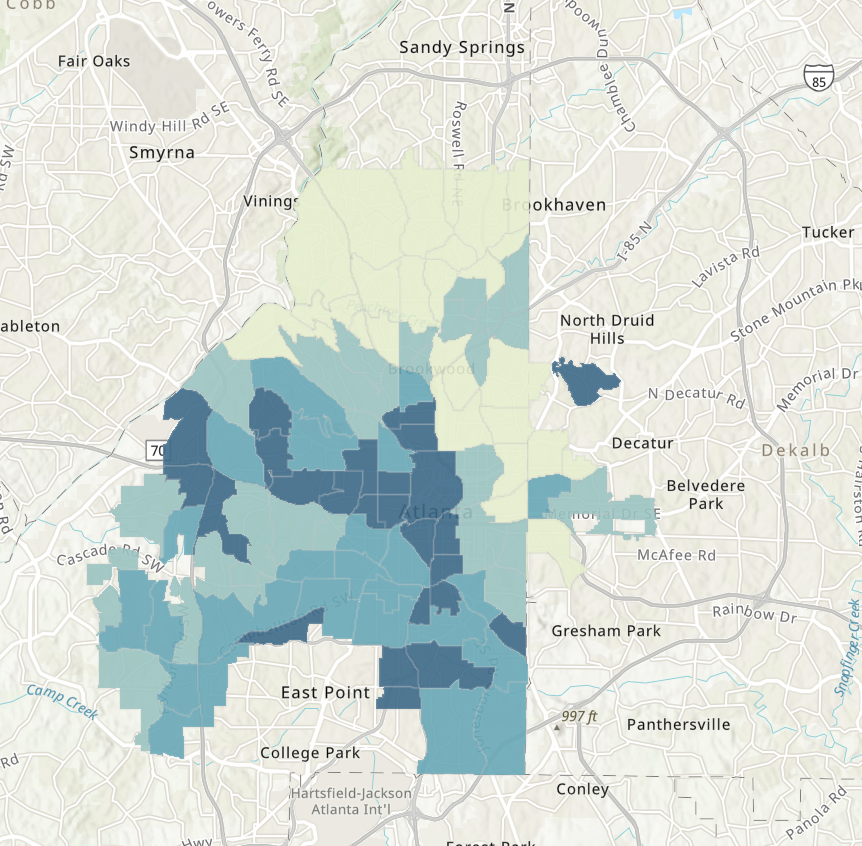
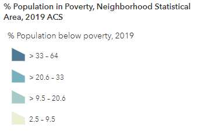
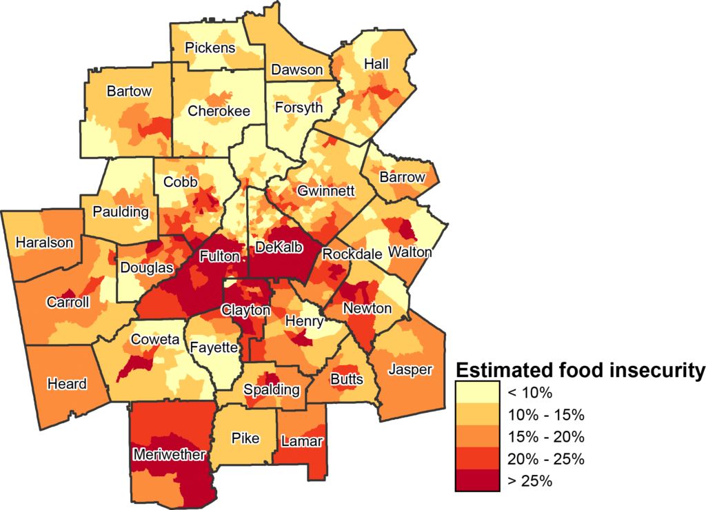
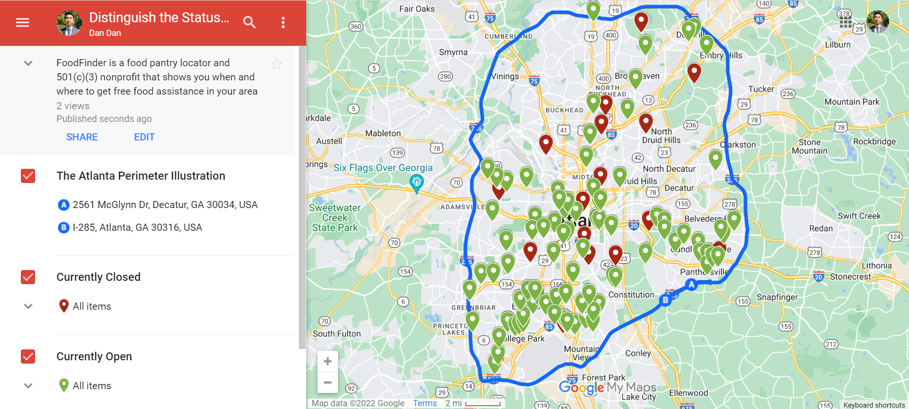

# Introduction
FoodFinder is a food pantry locator and 501(c)(3) nonprofit that shows you when and where to get free food assistance in your area. 

The image below shows the homepage of FoodFinder. Each red pin represents a food assistance program, including the program's details such as contact, operating hours/days, and service information.

Users can find food assistance programs nearby by typing in a zip code or enabling location sharing. 

```{r, echo=FALSE}

```


These are the required RStudio packages for the report
```{r}
pacman::p_load(knitr, tidyverse, openxlsx)
```


# Examining the Food Programs in Atlanta
This report examines 110 food programs within Interstate 285, an Interstate Highway loop encircling Atlanta, Georgia. People in Atlanta commonly refer to this loop as "The Perimeter." We compile a list of 110 food programs within the Perimeter and organize the list based on crucial information such as contact(email, call), operating days/hours, services provided, and services area are **MISSING** for each entry. 

By looking at what is **MISSING** for each entry, we seek to observe the number of programs that have incomplete information, the locations of these programs, and the other negative effect of incomplete information on people/neighborhoods that experience severe food insecurity.

# Data Manipulataion and Visualization Process

#### **Data Manipulation**

First, we import data from our master excel sheet `FoodFinder.csv` that contains the 110 entries
```{r}
foodFinder <- read.csv("food_programs_cleaned.csv")
```

Next, We separate the data into four different xlsx files:
1. `no_contact` - a list of programs with NO contact information(email, call)
2. `no_time` - a list of programs with NO Operating Days/Hours
3. `no_services_area` - a list of programs with NO services area info
4. `no_services_provided` - a list of programs with NO services provided info

```{r}
no_contact <- foodFinder %>% 
  filter(call == "n/a", email == "n/a")
# no_contact consists of entries with no call and email information

no_time <- foodFinder %>% 
  filter(operating_time == "n/a")

no_services_provided <- foodFinder %>% 
  filter(services_provided == "n/a")

no_services_area <- foodFinder %>% 
  filter(services_area == "n/a")
```

Next, we export the newly separated data into four xlsx files
```{r}
write.xlsx(no_services_provided, file = "No Services Provided.xlsx")
write.xlsx(no_services_area, file = "No Services Area.xlsx")
write.xlsx(no_contact, file = "No Contact.xlsx")
write.xlsx(no_time, file = "No Operating Time.xlsx")
```


#### **Data Visualization with "Google My Maps"**

My Maps Link:
FoodFinder's Information about the Food Providers in Atlanta (https://www.google.com/maps/d/edit?mid=1icbfYUXN-LfAW0Io2CCl0x1vwZ9H5EE&usp=sharing)

**Google My Maps** is a service through Google Maps that allows us to use the Google Maps infrastructure to attach information to locations and create custom maps for our project. 

After separating our data into four xlsx files, we import each spreadsheet to My Maps and pinpoint each food program by its `directions` variable.  

```{r, echo=FALSE}

```

We illustrate The Perimeter with the blue line and the 110 food programs with purple pins.

##### **Food Programs with No Contact Information**
with our 110 sample food programs, 4 of them have no call and email information. These four points locate in the south and southwest corners of The Perimeter.  

```{r, echo=FALSE}

```


The food program's contact information is one of the most crucial details that FoodFinder should obtain on its website. Getting contact information not only expedites communication between the FoodFinder's users and the food programs but also informs users that the pin represents a legitimate program with trusted and verifiable credentials.


##### **Food Programs with No Operating Days/Hours**
The following important piece of information is the operating days/hours. There are 15 food programs with no information on the operating days/hours. Four of them are above highway Interstate 20, and 11 programs are below the highway. The map shows that most sites with no operating days/hours information locate in the south of Atlanta.

```{r, echo=FALSE}

```


Without contact information, users can still walk up to or drive through the sites with accurate addresses. However, not all sites are open 24/7. Therefore, having a complete and accurate list of operating time information for each site prevents any time conflict or confusion and expedites the process of food distribution.


##### **Food Programs with No Services Provided**
A total of 45 food programs in Atlanta do not have the information on the type of services they provide. Most of these locations are in Atlanta's south, southeast, and southwest corners. 

```{r, echo=FALSE}

``` 
Each site should obtain a list of products or services to inform the locals or users. This information benefits people seeking to get a specific type of food. Some people might have the facility or ability to cook fresh grocery items; others might want to have readily prepared hot meals because of their economic background and current living situation. 

##### **Food Programs with No Services Area**

Service Area information is vital for the food programs as it can reduce the burden of serving a large population. Having the complete Service Area information and the Service Provided information on FoodFinder allows users to go to the nearby sites where they have their desired services. It can prevent everyone in one area from going to only one food program site all at once.

```{r, echo=FALSE}

``` 


# Poverty and Food Insecurity in the Southern Regions of Atlanta

While analyzing and visualizing the data, we observe that organizations in the **South, Southeast, and Southwest** corners of The Perimeter commonly lack one or two pieces of relevant information among the 110 sample food programs. Connecting to the economic condition in Atlanta, we can better understand how incomplete information can negatively impact the communities in the southern regions of Atlanta. 

```{r, echo=FALSE}


```
The graph shows the percentage of the population in poverty in parts of Fulton County, GA, which encompass a large area of Atlanta. The dark blue color represents a high percentage of the impoverished population. The northern regions of Atlanta (within the Perimeter) have a relatively low percentage of impoverished people. However, the Southern end of Atlanta faces a significant amount of poverty. 

```{r, echo=FALSE}

```

Poverty is not the only thing that hurts the communities south of Atlanta. As a result of poverty, food insecurity is also prevalent in the southern neighborhood. The map above highlights the estimated percentage of the population experiencing food insecurity. The southern region of Atlanta within The Perimeter is illustrated by the point where Fulton County, DeKalb County, and Clayton County intersect. This area has one of the most severe food insecurity problems in the Atlanta Metropolitan Area. 

# FoodFinder's Potential Strategy

The southern regions of Atlanta consist of a population with a higher poverty rate and food insecurity than the northern regions of Atlanta. Therefore, food programs in the south of Atlanta would have the most burden of providing food and resources to impoverished individuals. Based on the current data from FoodFinder, most food programs in the southern regions do not have a complete set of information for the users to connect them directly and efficiently. Missing and invalid information can inefficiently cause the users to look for other more trustworthy and legitimate sites. As a result, this can potentially put a heavier burden on one particular site in one large city region.

##### **Strategy 1 - Prioritize Editing and Adding Food Programs' Profiles in Impoverished Areas**
FoodFinder should first identify a list of regions or zipcodes in different cities with a high percentage of the population living in poverty and suffering food insecurity. With a list of areas, FoodFinder should prioritize sourcing a complete set of information (contact, operating days/hours, services) for each region's food program. We believe that striving to present the most accurate and comprehensive profiles of food programs in the most impoverished areas on FoodFinder's map can positively impact people suffering from food insecurity.


##### **Strategy 2 - Distinguish the Status of the Food Programs Based on the Operating Time on the Map**
In addition to creating accurate and complete profiles, FoodFinder can improve its map by distinguishing the pin color based on the site's operating days/hours. Currently. the map utilizes the traditional red pin as a way to locate each site. To make it more user-friendly, FoodFinder can update the site's status by illustrating the ones that are open and the ones that are closed.

```{r, echo=FALSE}

```

The figure above illustrates how FoodFinder can inform users which sites are open and closed. Providing the additional feature of site status can help the users to expedite their findings with a clear visualization on the map.

My Maps link:
Basic Illustration of Strategy 2
(https://www.google.com/maps/d/edit?mid=1k6DLgDxcHJDgFG89qVFvl3Hxoc2fXoI&usp=sharing)


